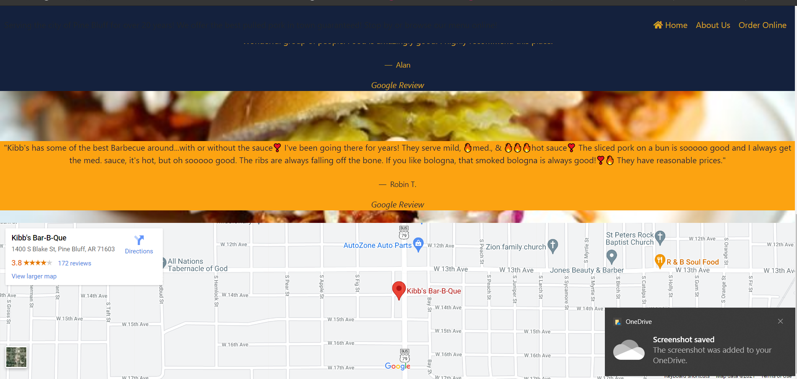
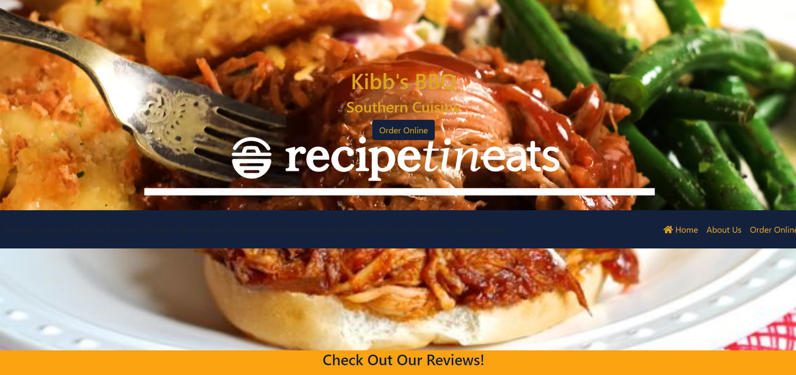

## Restaurant Revival
#### The requirements for this project were to find a restaurant website that wasn't so pretty and make it our own.
* The best pulled pork sandwich I've ever had has been in my hometown but the restaurant does not have a website.
* HTML, CSS, and Javascript was used to complete this project
* With a little ambition and coordination, maybe Kibb's BBQ can partner with food delivery companies and really bring in business!

<a href="https://bbqwebsite.netlify.app/">View Website Here</a>

## Screenshots

 

